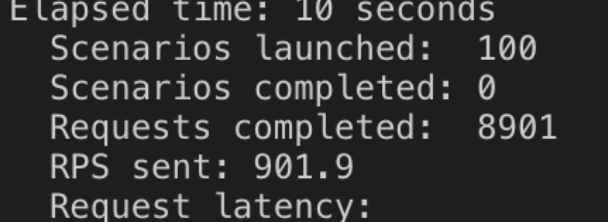

# item-des
# 
SDC Engineering Journal and Notes:

Date: July 23, 2019

Challenges Faced: Decision on platforms to use, setting up .env files, dealing with size.

Came across two main issues with  the database, the first was the .env file connecting to MongoDB Atlas, because this program is someones previous files I was having a difficult time getting some the packages I regularly use, such as 'dotenv', to properly access the env file. I instead had to set the file up as a js file and export the authorization. 

Size, it turns out that 10 million is a lot. Once I figured out a workaround for the .env file Mongo Atlas just wasn't going to cut it. The size would just be insane and paying for a server would be money needlessly spent, so I'm going to make it local and containerize with Docker and make it an EC2 instance. 

Data: July 24, 2019

MongoDB and the Ten Million

Today's main predicament was dealing with populating the MongoDB and measuring the most effective ways to pull and add data to a 10 million count db. One of the initial problem was just adding data to the database, I used the faker npm to generate fake data. This initially wasn't a problem until I ran into some async issues which originated because there are limits to the amount of data you can push into MongoDB at a time as been below by the following error.

Error Code: "FATAL ERROR: Ineffective mark-compacts near heap limit Allocation failed - JavaScript heap out of memory"

I got around this by incrementing my insertions to be in batches of 100,000. This was effective and led to a total insertion time of: Time to create DB: "performance: 84013.647ms". Which wasn't bad though it was a rather large file size of nearly a gigabyte. I realized there was some repetition with the id tags because I was generating a unique ID tag every time but mongoDB was still giving me the placeholder of " _id" every time as well, so I had two unique IDs. This meant that when I was listening for an ID from the other microservices that I would then use to query my DB for that ID but it was doing so in Big O(n) time for a total search time of Time to find by ID: "findPerf: 3228.325ms". I killed two birds with one stone by stipulating my own "_id" and stating that is was in fact unique. This allowed me to cut my DB size by about 200MB and also shorten the creation time to:  Time to createDB w/ unique ID given by me: "performance: 61121.405ms". More importantly, my time to find a ID became Big O(1), with a total search time of: Time to findOne: "findOnePerf: 33.810ms"
Data: July 24, 2019

PostgreSQL

Today was about PostgreSQL and immulating what I did with MongoDB. It was a lot of reading and understanding the differences between regular mySQL and Postgre, it does seem that Postgre is more powerful but the syntax can be confusing at times. I can see the added benefits because Postgre does appear more powerful and the fact that it is open-source gives it certain benefits. In the end the insertion times to my Postgre data base were abysmal standing at a time of: Time to Create: "makeMany: 2293256.430ms" which is leaps and bounds more time compared to my mongoDB data generation which took 60 seconds. There is a way to insert into Postgre using CSV files with a copy method but I was looking to have that functionality built into node.js but I couldn't find a solution that was sensible. 

The time to find one was relatively similar to that of MongoDB at: Time to FindOne: "findOne: 20.498ms", which isn't materially different from similar queries with my non-relational db. 

Date: July 25, 2019

Routing and Jest

Today was mainly spent reading though Jest documentation and understanding the testing strategy, I decided on Jest because the framework and library are one, unlike Mocha and Chai. I knew there were going to be problems with the tests because all of my function were asynchronous so instead of diving into the deep end I spent time walking through the documentation on more simplistic tests to ensure I understood Jest. 

I also spent time setting up my routes between my db and server to the front end, I got this working successfully on both MongoDB and Postgre. It was relatively simple but webpack doesn't like my new server "index.js" files so I'll have to figure that out but for the moment the Postman requests will do for testing. 

Tomorrow I will dive into Jest and async functions now that I feel comfortable with Jest, it look powerful and the syntax is clear and I do appreciate the fact that I get instant visual feedback on my functions, which is nice considering I'm used to front-end work right now which gives you a finished product at the end of the day. 

Date: July 26, 2019

TearDown Functions
Todays focus was creating all the tests for Jest and also begin stress testing my database and server locally. The Jest tests were relatively simple because my component only has a get request to return all the information associated with a specific ID given to it. Once hiccup was the fact that kept getting the same error and the Jest testing wouldn't close out: 

"Jest did not exit one second after the test run has completed."

This was because I was making async calls to the database which wasn't closing out, I resolved this with a tear down function:  afterAll(() => monDB.db.close()). This cleared up my issue fully, was able to run a complete suit of tests on both the mongoDB and PostGre databases and routes. 

I spent the rest of the data learning more about Artillery and starting initial testing on that, the results were in the ballpark to be considered good, with my request per second being fulfilled being around 2,000 on both databases. 
First Run on Artillery MongoDB
RPS sent: 2006.62

First Run on PostGreSql
RPS sent: 1959.56

Date: July 29, 2017

Clustering
My thought processes is that my inability to boost my RPS is the fac that I'm not leveraging my multicore processor, as node.js is a single threaded application and only takes advantage of one core. I used the node cluster tool to create a master that would create a new instance of node that I could have balance the load of the request coming in from artillery, I create 12 children that would take over requests.  
  

MongoDB
No obvious gain from running 12 different node processes using all 12 cores. 
  

PostGreSQL
Similar results on PostGre 
  

Results
 The bottleneck is not the fact that node is a single threaded and can't take advantage of a multicore processor. Therefore the limitation must either be the database or from talking with my classmates, the issue lies with Artillery and it's inability to send 10,000 requests a second, it looks like my hang up is around 2,000 RPS. It makes sense because artillery is probably single threaded and it takes up CPU resources that are need for the actual request processing. I'll be able to do more load balancing testing once I deploy because then I can use cloud based versions of artillery that won't suck up my internal CPU resources. 

Date: July 30, 2017

Deployment was rather simple using Docker and EC2, and the stress test results were slightly slower, which was to be expected but overall the response completion rate was well within the expected range. 

AWS Stress Testing:  
  